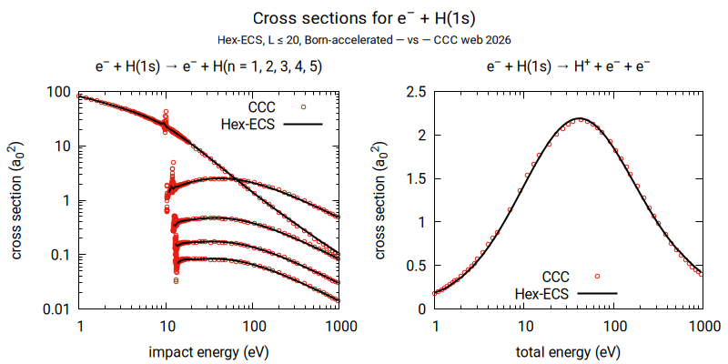
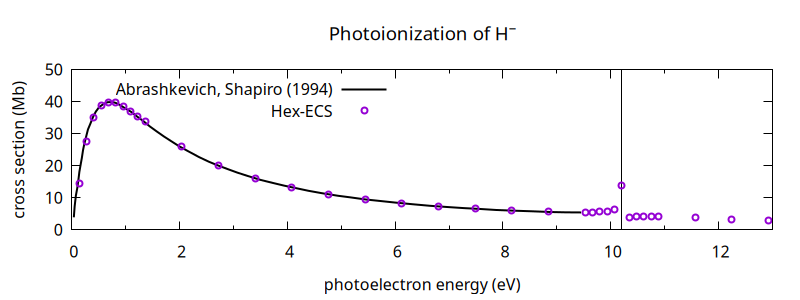

HEX: Hydrogen-electron collision solver
=======================================

HEX provides a suite of C++ programs that solve the electron-hydrogen scattering problem.

The main component is the program `hex-ecs`, which implements exterior complex scaling (ECS) method and iterative solution
for the scattered wave using preconditioned conjugate orthogonal conjugate gradients (PCOCG).

For extrapolation of results to high angular momenta ("Born top-up"), the programs `hex-dwba` and `hex-fullborn` can be
used. `hex-dwba` computes partial-wave T-matrices in the distorted wave Born approximation, or in the plane wave Born
approximation when run with `--nodistort`. `hex-fullborn` evaluates the total plane wave Born cross section (without
exchange), summed over all angular momenta.

`hex-ecs` and `hex-dwba` produce scattering T-matrices in form of SQL files. These are aggregated by `hex-db` into a single
SQLite3 database. The same program `hex-db` can be then used to extract observables from this database. It can also
interpolate missing energy points.

Finally, `hex-ecs` can be used to calculate bound states of two-electron atoms and to solve perturbative photoionization,
either by means of the Fermi golden rule formula (as a dipole transition between the initial bound and final scattering
state), or by matching asymptotics of solution of dripole-driven Schrödinger equation.

The hard requirements for HEX are:

 - C++17 compiler and CMake 3.20 or later
 - BLAS and LAPACK (e.g. OpenBLAS or Intel MKL)
 - GNU Scientific Library
 - SQLite3

Some functionality requires the following:

 - CLN and GiNaC (symbolic Born amplitudes: the plane wave mode of `hex-dwba` and the dipole Born subtraction in `hex-db`)
 - MPI (for distributed runs of `hex-ecs`)

The following are nice to have, as they add some additional capabilities:

 - UMFPACK (part of SuiteSparse - for sparse LU decomposition in `hex-ecs`)
 - Pardiso (stand-alone library or Intel MKL Pardiso - for sparse LU decomposition in `hex-ecs`)
 - SuperLU (for sparse LU decomposition in `hex-ecs`)
 - MUMPS (for large-scale distributed LU decomposition in `hex-ecs`)
 - SuperLU_DIST (for large-scale distributed LU decomposition in `hex-ecs`)
 - ScaLAPACK (for distributed dense LU decomposition in `hex-ecs`)
 - HDF5 (needed by the `hex-hdf2hdf` conversion utility)
 - OpenCL (for GPU acceleration in `hex-ecs`)
 - libpng (printing matrix structure for debugging/illustrative purposes)
 - Doxygen (for generated documentation)

Every optional dependency is switched on by a `WITH_*` option, which `CMakeLists.txt` lists with a short description,
so a build with UMFPACK and OpenCL is configured as

    cmake -D WITH_UMFPACK=ON -D WITH_OPENCL=ON ..

The libraries themselves are searched for automatically, by the find modules of CMake and by those in `cmake/`. An
installation in an unusual place is pointed at the standard way, with `CMAKE_PREFIX_PATH` or a per-package `<PKG>_ROOT`:

    cmake -D WITH_SUPERLU=ON -D CMAKE_PREFIX_PATH=$HOME/opt/SuperLU ..

Should the search not work out, setting `<PKG>_LIBRARIES` (and `<PKG>_INCLUDE_DIRS` if headers are needed) skips it and
uses what is given, which is occasionally necessary for MUMPS and for the stand-alone PARDISO:

    cmake -D WITH_MUMPS=ON -D MUMPS_INCLUDE_DIRS=/usr/include/mumps \
          -D MUMPS_LIBRARIES="-L/usr/lib64/mpi/gcc/openmpi5/lib64;zmumps;mumps_common;pord" ..

A `WITH_*` option that is on is a hard requirement: if the library cannot be found, the configuration stops and says so,
rather than leaving it out. The configuration ends with a summary of what the build will and will not use.
